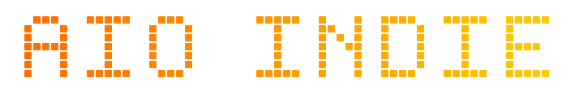

<!-- Header -->

 

<em>Developer · Pixel Artist · 3D Artist · Music Prod · UI/UX · Content Creator · Musician</em>

---

## Stack

**Languages**

**Frameworks & Tools**

---

## Creative

| craft &nbsp;&nbsp;&nbsp;&nbsp;&nbsp;&nbsp;&nbsp;&nbsp;&nbsp;&nbsp;&nbsp;&nbsp;&nbsp;&nbsp;&nbsp;&nbsp;&nbsp;&nbsp;&nbsp;&nbsp;&nbsp;&nbsp;&nbsp;&nbsp; | notes &nbsp;&nbsp;&nbsp;&nbsp;&nbsp;&nbsp;&nbsp;&nbsp;&nbsp;&nbsp;&nbsp;&nbsp;&nbsp;&nbsp;&nbsp;&nbsp;&nbsp;&nbsp;&nbsp;&nbsp;&nbsp;&nbsp;&nbsp;&nbsp; |
|---|---|
|  Pixel art | Characters, tilesets, animations |
|  3D modeling | Mostly for game assets — Unreal pipeline |
|  UI/UX design | Design first, then build it myself |
|  Guitar | Fingerstyle since childhood. Self-diagnosed gifted. |
|  Music prod | FL Studio, retired. The beats were hard though. |
|  Video editing | Yes I'll color grade your cat video. No I won't. |
|  Gaming | 5,000+ hrs in a game I claim to be bad at |

---

 yurekavoid@gmail.com · socials media? this 🥔 butter than that.

[fab.com/sellers/Yureka](https://www.fab.com/sellers/Yureka) &nbsp;·&nbsp; [yureka.dev](https://yureka.dev) &nbsp;·&nbsp; [pixel.yureka.dev](https://pixel.yureka.dev)

